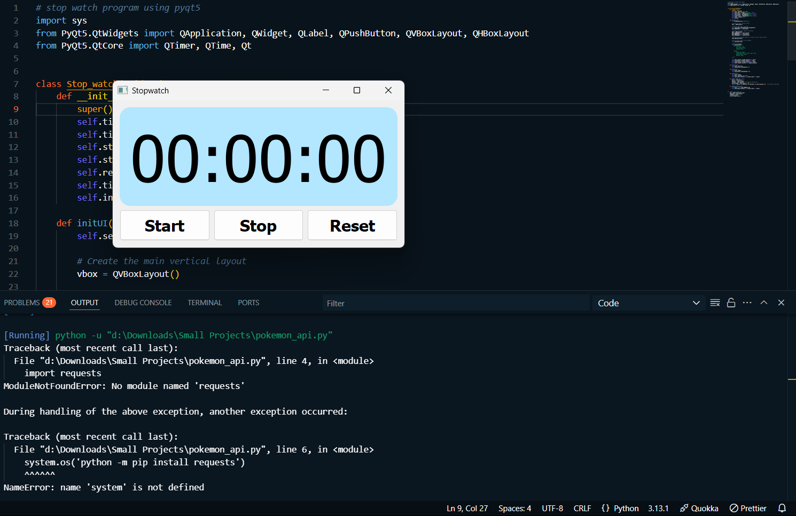

# Stopwatch using PyQt5

A simple stopwatch application built using PyQt5 in Python. This program allows you to start, stop, and reset a stopwatch with millisecond precision.

---

## Features
- Start, stop, and reset functionality.
- Displays time in `HH:MM:SS.MS` format.
- Updates the time every 10 milliseconds for precision.
- Clean and responsive user interface.
- Customizable styles using CSS-like syntax.

---

## Prerequisites
Before running the program, ensure you have the following installed:
- Python 3.x
- PyQt5 library

---
