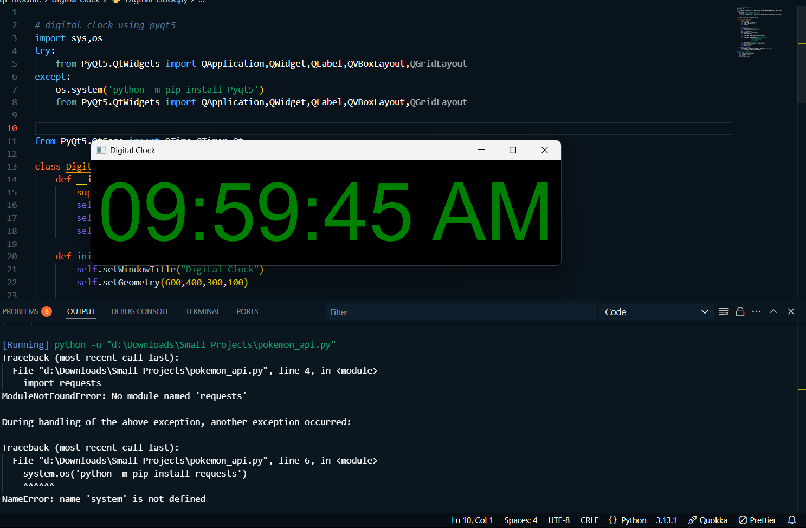

# Digital Clock using PyQt5

A simple digital clock application built using PyQt5 in Python. This program displays the current time in a graphical window and updates every second.

---

## Features
- Displays the current time in `hh:mm:ss AM/PM` format.
- Updates the time every second.
- Customizable font size, color, and background.
- Responsive and centered layout.

---

## Prerequisites
Before running the program, ensure you have the following installed:
- Python 3.x
- PyQt5 library

---

 explaination of imported modules 

Class	Purpose
QApplication --> Manages the application and event loop.
QWidget-->	Base class for creating windows or containers for other widgets.
QLabel	-->Displays text or images (e.g., the clock time).
QVBoxLayout	-->Arranges widgets vertically in a column.
QGridLayout	-->Arranges widgets in a grid (rows and columns) for complex layouts.

## Customization Options 
self.time_label.setStyleSheet("font-size: 100px;")
self.time_label.setStyleSheet("color: red;")
self.setStyleSheet("background-color: white;")

Workflow of the Program
Import Modules:

The program imports necessary modules like QApplication, QWidget, QLabel, QPushButton, QVBoxLayout, QHBoxLayout, QTimer, and QTime from PyQt5.

Create the Main Window:

The Stop_watch class inherits from QWidget and sets up the main window.

Set Up the UI:

A QLabel is used to display the time.

Three buttons (Start, Stop, Reset) are created and arranged horizontally using QHBoxLayout.

The main layout is a vertical layout (QVBoxLayout) that includes the time label and the button layout.

Styling:

The buttons and label are styled using setStyleSheet() to set font sizes, padding, and background colors.

Timer Logic:

A QTimer is used to update the time every 10 milliseconds.

The update_display method updates the time and formats it as HH:MM:SS.MS.

Button Functionality:

Start: Starts the timer.

Stop: Pauses the timer.

Reset: Stops the timer and resets the time to 00:00:00.00.

Run the Application:

The QApplication instance is created, and the main event loop is started using app.exec_().

Customization
You can customize the appearance of the stopwatch by modifying the setStyleSheet() method in the initUI function. For example:

Change the font size of the time label:

self.time_label.setStyleSheet("font-size: 100px;")
Change the button colors:

self.setStyleSheet("QPushButton { background-color: lightblue; }")